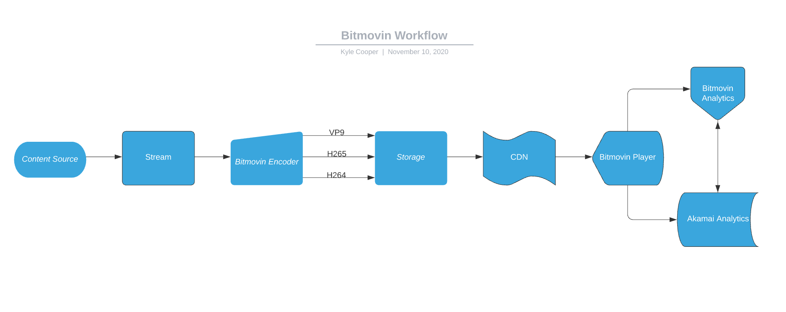

Hi Chris,

Thank you for reaching out! I strongly believe that the customer could benefit greatly from using all of Bitmovin's products: Analytics, The Encoder, and The Player.

It appears that the customer would like to expand their VoD service with premium content and monetize some content for free users. This can be accomplished with Bitmovin's Encoder and Player products. 

Using the Bitmovin Encoder, the customer can utilizae a multi-codec approach that will supply a compatible video format for every type of device or browser. 

####Multi-Codec Approach

```markdown
configProvider = new ConfigProvider(args);

bitmovinApi =
        BitmovinApi.builder()
        .withApiKey(configProvider.getBitmovinApiKey())
        .withLogger(
        new Slf4jLogger(), Level.FULL) // set the logger and log level for the API client
        .build();

HttpInput input = createHttpInput(configProvider.getHttpInputHost());

Output output =
        createS3Output(
            configProvider.getS3OutputBucketName(),
            configProvider.getS3OutputAccessKey(),
            configProvider.getS3OutputSecretKey());

String inputFilePath = configProvider.getHttpInputFilePath();

H264AndAACEncodingTracking h264AndAacEncodingTracking =
        createH264AndAacEncoding(input, inputFilePath, output);

H265EncodingTracking h265EncodingTracking = 
        createH265Encoding(input, inputFilePath, output;

Vp9AndVorbisEncodingTracking vp9AndVorbisEncoding =
        createVp9AndVorbisEncoding(input, inputFilePath, output);

ExecutorService executor = Executors.newFixedThreadPool(3);

List<Callable<Encoding>> encodingTasks =
        Arrays.asList(
            () -> executeEncoding(h264AndAacEncodingTracking.encoding),
            () -> executeEncoding(h265EncodingTracking.encoding),
            () -> executeEncoding(vp9AndVorbisEncoding.encoding));

executor.invokeAll(encodingTasks);

executor.shutdown();

DashManifest dashManifest =
        createDashManifest(
            output, h264AndAacEncodingTracking, h265EncodingTracking, vp9AndVorbisEncoding);

executeDashManifest(dashManifest);

HlsManifest hlsManifest =
        createHlsManifest(output, h264AndAacEncodingTracking, h265EncodingTracking);

executeHlsManifest(hlsManifest);
}
}
```

This type of approach reaches the maximum number of devices and insures the highest quality possible for all premium content.

Beyond this concern, the customer would also like to run advertisements for free users and capture different categories of user data. The Player can be configured to run ads based on multiple types of advertising standards, as well as schedule the ads at anytime throughout the free content. 

The customer would also like to collect these specific data points:

1. How many plays happened on video       
2. Ratio between skipped ads and ads played in entirety
3. How long each stream is watched on average

Bitmovin's Analytics product can capture all of these metrics and more.

Under the Audience category, Analytics records the number of plays on a video. Analytics also records the View Time metric which is the average time spent on a video. For list item #2 above, Analytics collects a Completion Rate metric under the Advertising category. Completion Rate keeps track of of how long a viewer watches an ad before it is skipped. It also notes when an ad is watched in it's entirety.

The customer expressed a concern with integrating analytics data with Akamai Analytics. The Player already supports integration with Akamai Analytics.

More information on integrating Akamai Analytics can be found at https://github.com/bitmovin/bitmovin-player-akamai-analytics

In conclusion, Bitmovin products check all the boxes the customer is looking for. Although the customer is currently using JWPlayer, the Bitmovin Player appears to be a great fit. Below, I have laid out a simple workflow diagram. Please do not hesistate to reach out to me with any questions!




